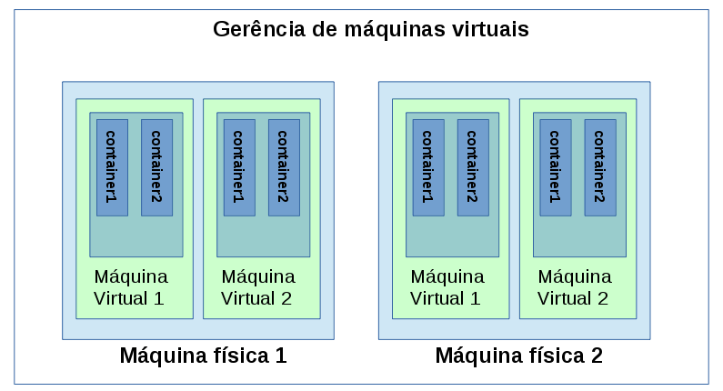

## Container ou máquina virtual?

Após o sucesso repentino do Docker - virtualização com base em contêiners - muitas pessoas têm se questionado sobre possível migração do modelo de máquina virtual para contêiners.

Respondemos tranquilamente: **Os dois!**

Ambos são métodos de virtualização, mas atuam em “camadas” distintas. Vale a pena detalhar cada solução para deixar claro que, não são, necessariamente, concorrentes.

### Máquina virtual

Conceito antigo, oriundo dos Mainframes em meados de 1960. Cada operador tinha a visão de estar acessando uma máquina dedicada, mas na verdade, todo recurso do Mainframe, era compartilhado para todos os operadores.

O objetivo do modelo é compartilhar recursos físicos entre vários ambientes isolados, sendo que, cada um deles tem sob tutela uma máquina inteira: com memória, disco, processador, rede e outros periféricos, todos entregues via abstração de virtualização.

É como se dentro da máquina física, se criasse máquinas menores e independentes entre sí. Cada máquina tem seu próprio sistema operacional completo que, por sua vez, interage com os hardwares virtuais que lhe foram entregues pelo modelo de virtualização a nível de máquina.

Vale ressaltar: o sistema operacional instalado dentro da máquina virtual fará interação com os hardwares virtuais e não com o hardware real.

Com a evolução desse modelo, os softwares que implementam a solução, puderam oferecer mais funcionalidades, tais como melhor interface para gerência de ambientes virtuais e alta disponibilidade utilizando vários hosts físicos.

Com as novas funcionalidades de gerência de ambientes de máquinas virtuais é possível especificar quanto recurso físico cada ambiente virtual usa e, até mesmo, aumentar gradualmente em caso de necessidade pontual.

Atualmente, as máquinas virtuais são realidade para qualquer organização que necessite de ambiente de TI, pois facilita a gerência das máquinas físicas e o compartilhamento entre os diversos ambientes necessários para a infraestrutura básica.

### Contêiner

Esse modelo de virtualização está no nível de sistema operacional, ou seja, ao contrário da máquina virtual, um contêiner não tem visão da máquina inteira, é apenas processo em execução em um kernel compartilhado entre todos os outros contêiners.

Utiliza o namespace para prover o devido isolamento de memória RAM, processamento, disco e acesso à rede. Mesmo compartilhando o mesmo kernel, esse processo em execução tem a visão de estar usando um sistema operacional dedicado.

É um modelo de virtualização relativamente antigo. Em meados de 1982, o chroot já fazia algo que podemos considerar virtualização a nível de sistema operacional e, em 2008, o LXC já fazia algo relativamente parecido ao Docker, hoje. Inclusive, no início, o Docker usava o LXC, mas hoje tem interface própria para acessar o namespace, cgroup e afins.

Como solução inovadora o Docker traz diversos serviços e novas facilidades que deixam o modelo muito mais atrativo.

A configuração de ambiente LXC não era tarefa simples; era necessário algum conhecimento técnico médio para criar e manter um ambiente com ele. Com o advento do Docker, esse processo ficou bem mais simples. Basta instalar o binário, baixar as imagens e executá-las.

Outra novidade do Docker foi a criação do conceito de “imagens”. Grosseiramente podemos descrever as imagens como definições estáticas daquilo que os contêiners devem ser na inicialização. São como fotografias do ambiente. Uma vez instanciadas e, colocadas em execução, assumem a função de contêiners; saem da abstração de definição e se transformam em processos em execução, dentro de um contexto isolado. Enxergam um sistema operacional dedicado para sí, mas na verdade compartilham o mesmo kernel.

Junto à facilidade de uso dos contêiners, o Docker agregou o conceito de nuvem, que dispõe de serviço para carregar e “baixar” imagens Docker. Trata-se de aplicação web que disponibiliza repositório de ambientes prontos, onde viabilizou um nível absurdo de compartilhamento de ambientes.

Com o uso do serviço de nuvem do Docker, podemos perceber que a adoção do modelo de contêiners ultrapassa a questão técnica e adentra assuntos de processo, gerência e atualização do ambiente; onde, agora é possível compartilhar facilmente as mudanças e viabilizar uma gestão centralizada das definições de ambiente.

Utilizando a nuvem Docker agora, é possível disponibilizar ambientes de teste mais leves, permitindo que, em plena reunião com o chefe, você pode baixar a solução para um problema que ele descreve e mostrar antes que ele saia da sala. Permite também que você consiga disponibilizar padrão de melhores práticas para determinado serviço e compartilhar com todos da sua empresa e além, onde pode receber críticas e executar modificações com o passar do tempo.

### Conclusão

Com os dados apresentados, percebemos que o ponto de conflito entre as soluções é baixo. Podem e, normalmente, são adotadas em conjunto. Você pode provisionar uma máquina física com um servidor de máquinas virtuais, onde serão criadas máquinas virtuais hospedes, que por sua vez terão o docker instalado em cada máquina. Nesse docker serão disponibilizados os ambientes com seus respectivos serviços segregados, cada um em um contêiner.

Percebam que teremos vários níveis de isolamento. No primeiro, a máquina física, que foi repartida em várias máquinas virtuais, ou seja, já temos nossa camada de sistemas operacionais interagindo com hardwares virtuais distintos, como placas de rede virtuais, discos, processo e memória. Nesse ambiente, teríamos apenas o sistema operacional básico instalado e o Docker.

No segundo nível de isolamento, temos o Docker baixando as imagens prontas e provisionamento contêiners em execução que, por sua vez, criam novos ambientes isolados, a nível de processamento, memória, disco e rede. Nesse caso, podemos ter na mesma máquina virtual um ambiente de aplicação web e banco de dados. Mas em contêiners diferentes e, isso não seria nenhum problema de boas práticas de gerência de serviços, muito menos de segurança.

Caso esses contêiners sejam replicados entre as máquinas virtuais, seria possível prover alta disponibilidade sem grandes custos, ou seja, usando um balanceador externo e viabilizando o cluster dos dados persistidos pelos bancos de dados.

Toda essa facilidade com poucos comandos, recursos e conhecimento, basta um pouco de tempo para mudar o paradigma de gerência dos ativos e paciência para lidar com os novos problemas inerentes do modelo.
