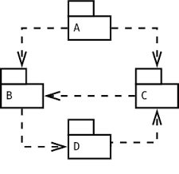

# Dependência

Seguindo a lista do modelo [12factor](http://12factor.net/), logo após a base de código que tratamos nesse [artigo](http://techfree.com.br/2016/06/dockerizando-aplicacoes-base-de-codigo/), temos a **“Dependência”** como segunda boa prática.



Essa boa prática sugere a declaração de todas as dependências necessárias para executar o código. Você não deve assumir que algum componente já está previamente instalado no ativo responsável por hospedar a aplicação.

Para viabilizar o “sonho” da portabilidade, precisamos gerenciar corretamente as dependências da aplicação em questão, isso indica que devemos, também, evitar a necessidade de trabalho manual na preparação da infraestrutura que dá suporte à aplicação.

Automatizar o processo de instalação de dependência é o grande segredo do sucesso para atender essa boa prática. Caso a instalação da infraestrutura não seja, suficientemente, automática para viabilizar a inicialização sem erros, o atendimento da boa prática fica prejudicado.

Esses procedimentos, automatizados, colaboram com a manutenção da integridade do processo, pois, o nome dos pacotes de dependências e respectivas versões, estão especificados no arquivo localizado no mesmo repositório do código que, por sua vez, é rastreado em um sistema de controle de versão. Com isso, podemos concluir que nada é modificado sem o devido registro.

O Docker se encaixa perfeitamente na boa prática. É possível entregar um perfil mínimo de infraestrutura para a aplicação. Por sua vez, a declaração explícita das dependências, para que a aplicação funcione no ambiente, faz-se necessária. 

A aplicação do exemplo, escrita em Python, como verificamos em parte do código abaixo, necessita de duas bibliotecas para funcionar corretamente:

```
from flask import Flask
from redis import Redis
```

Essas duas dependências estão especificadas no arquivo requirements.txt e, esse arquivo é usado como parâmetro do PIP.

“O PIP é um sistema de gerenciamento de pacotes usado para instalar e gerenciar pacotes de software escritos na linguagem de programação Python”. (Wikipedia)

O comando PIP é usado, junto ao arquivo requirements.txt, na criação da imagem, como demonstrado no Dockerfile da boa prática anterior (codebase):

```
FROM python:2.7
ADD requirements.txt requirements.txt
RUN pip install -r requirements.txt
ADD . /code
WORKDIR /code
CMD python app.py
```

Perceba que um dos passos do Dockerfile é instalar as dependências descritas no arquivo requirements.txt com o gerenciador de pacotes PIP do Python. Veja o conteúdo do arquivo requirements.txt:

```
flask==0.11.1
redis==2.10.5
```

É importante salientar a necessidade de especificar as versões de cada dependência, pois, como no modelo de contêiner, as imagens podem ser construídas a qualquer momento. É importante saber qual versão específica a aplicação precisa. Caso contrário, podemos encontrar problemas com compatibilidade se uma das dependências atualizar e não permaneer compatível com a composição completa das outras dependências e a aplicação que a utiliza.

Para acessar o código descrito aqui, baixe o [repositório](https://github.com/gomex/exemplo-12factor-docker) e acesse a pasta **“factor2“**.

Outro resultado positivo do uso da boa prática é a simplificação da utilização do código por outro desenvolvedor. Um novo programador pode verificar, nos arquivos de dependências, quais os pré-requisitos para a aplicação executar, assim como executar o ambiente sem necessidade de seguir a extensa documentação que, raramente, é atualizada.

Usando o Docker é possível configurar, automaticamente, o necessário para rodar o código da aplicação, seguindo a boa prática perfeitamente.
