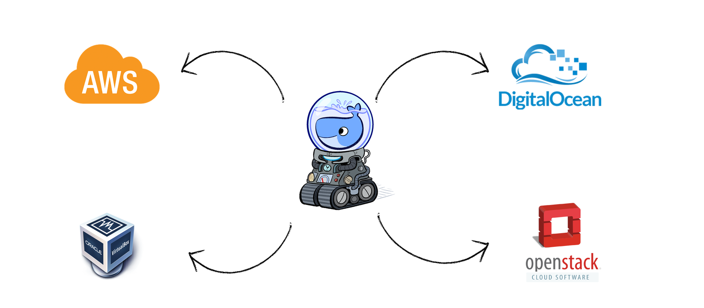
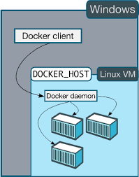

# Utilizando Docker em múltiplos ambientes

Docker host é o nome do ativo responsável por gerenciar ambientes Docker, nesse capítulo mostraremos como é possível criá-los e gerenciá-los em infraestruturas distintas, tais como máquina virtual, nuvem e máquina física.



[Docker machine](https://docs.docker.com/machine/) é a ferramenta usada para essa gerência distribuída, permite a instalação e gerência de docker hosts de forma fácil e direta.

Essa ferramenta é muito usada por usuários de sistema operacional “não linux”, como demonstraremos ainda, mas sua função não  limita-se a esse fim, pois também é bastante usada para provisionar e gerenciar infraestrutura Docker na nuvem, tal como AWS, Digital Ocean e Openstack.


### Como funciona

Antes de explicar como utilizar o docker machine, precisamos reforçar o conhecimento sobre a arquitetura do Docker.



Como demonstra a imagem acima, a utilização do Docker divide-se em dois serviços: o que roda em modo daemon, em background, chamado de **Docker Host**, responsável pela viabilização dos containers no kernel Linux; e, o cliente, que chamaremos de **Docker client**, responsável por receber comandos do usuário e traduzir em gerência do **Docker Host**.

Cada **Docker client** é configurado para se conectar a determinado **Docker host** e nesse momento o **Docker machine** entra em ação, pois viabiliza a automatização da escolha de configuração de acesso do Docker client a distintos **Docker host**.

O **Docker machine** possibilita utilizar diversos ambientes distintos apenas modificando a configuração do cliente para o **Docker host** desejado: basicamente modificar algumas variáveis de ambiente. Segue exemplo:

```
export DOCKER_TLS_VERIFY="1"
export DOCKER_HOST="tcp://192.168.99.100:2376"
export DOCKER_CERT_PATH="/Users/gomex/.docker/machine/machines/default"
export DOCKER_MACHINE_NAME="default"
```
Modificando essas quatro variáveis, o Docker client poderá utilizar um ambiente diferente rapidamente e sem precisar reiniciar qualquer serviço.

### Criando ambiente

O Docker machine serve principalmente para criar ambientes, futuramente geridos por ele na troca automatizada de contexto de configuração, através da mudança de variáveis de ambiente, como explicado anteriormente.

Para criar o ambiente é necessário verificar se a infraestrutura que deseja criar tem algum driver com suporte a esse processo. Segue a [lista de drivers disponíveis](https://docs.docker.com/machine/drivers/).

#### Máquina virtual

Para esse exemplo, usaremos o driver mais utilizado, o [virtualbox](https://docs.docker.com/machine/drivers/virtualbox/), ou seja, precisamos de um [virtualbox](https://www.virtualbox.org/) instalado na nossa estação para que esse driver funcione adequadamente.

Antes de criar o ambiente vamos entender como funciona o comando de criação do docker machine:

docker-machine create --driver=<nome do driver>  <nome do ambiente>

Para o driver **virtualbox** temos alguns parâmetros que podem ser utilizados:

|Parâmetro   | Explicação |
|-----------|------------|
|--virtualbox-memory  | Especifica a quantidade de memória RAM que o ambiente pode utilizar. O valor padrão é 1024MB. (Sempre em MB) |
|--virtualbox-cpu-count | Especifica a quantidade de núcleos de CPU que esse ambiente pode utilizar. O valor padrão é 1 |
|--virtualbox-disk-size | Especifica o tamanho do disco que esse ambiente pode utilizar. O valor padrão é 20000MB (Sempre em MB) |

Como teste utilizamos o seguinte comando:

```
docker-machine create --driver=virtualbox --virtualbox-disk-size 30000 teste-virtualbox
```

O resultado desse comando é a criação de uma máquina virtual no virtualbox. A máquina terá 30GB de espaço em disco, 1 núcleo e 1GB de memória RAM.

Para validar se o processo aconteceu como esperado, basta utilizar o seguinte comando:

```
docker-machine ls
```
O comando acima é responsável por listar todos os ambientes que podem ser usados a partir da estação cliente.

Pra mudar de cliente basta utilizar o comando:

```
eval $(docker-machine env teste-virtualbox)
```
Executando o comando **ls** será possível verificar qual ambiente está ativo:

```
docker-machine ls
```

Inicie um container de teste pra testar o novo ambiente

```
docker container run hello-world
```

Caso deseje mudar para outro ambiente, basta digitar o comando abaixo, usando o nome do ambiente desejado:

```
eval $(docker-machine env <ambiente>)
```
Caso deseje desligar o ambiente, utilize o comando:

```
docker-machine stop teste-virtualbox
```
Caso deseje iniciar o ambiente, utilize o comando:

```
docker-machine start teste-virtualbox
```
Caso deseje remover o ambiente, utilize o comando:

```
docker-machine rm teste-virtualbox
```
Tratamento de problema conhecido: caso esteja utilizando Docker-machine no MacOS e por algum motivo a estação hiberne quando o ambiente virtualbox tenha iniciado, é possível que, no retorno da hibernação, o Docker host apresente problemas na comunicação com a internet. Orientamos a, sempre que passar por problemas de conectividade no Docker host com driver virtualbox, desligue o ambiente e reinicie como medida de contorno.

#### Nuvem

Para esse exemplo usamos o driver da nuvem mais utilizada, [AWS](http://aws.amazon.com/). Para tanto, precisamos de uma conta na AWS para que [esse driver](https://docs.docker.com/machine/drivers/aws/) funcione adequadamente.

É necessário que suas credenciais estejam no arquivo ~/.aws/credentials da seguinte forma:

```
[default]
aws_access_key_id = AKID1234567890
aws_secret_access_key = MY-SECRET-KEY
```

Caso não deseje colocar essas informações em arquivo, você pode especificar via variáveis de ambiente:

```
export AWS_ACCESS_KEY_ID=AKID1234567890
export AWS_SECRET_ACCESS_KEY=MY-SECRET-KEY
```
Você pode encontrar mais informações sobre credencial AWS [nesse artigo](http://blogs.aws.amazon.com/security/post/Tx3D6U6WSFGOK2H/A-New-and-Standardized-Way-to-Manage-Credentials-in-the-AWS-SDKs).

Quando criamos um ambiente utilizando o comando **docker-machine create**, o mesmo é traduzido para AWS na criação uma [instância EC2](https://aws.amazon.com/ec2/) e, em seguida é instalado todos os softwares necessários, automaticamente, no novo ambiente.

Os parâmetros mais utilizados na criação desse ambiente são:

|Parâmetro   | Explicação |
|-----------|------------|
|--amazonec2-region | Informa qual região da AWS é utilizada para hospedar seu ambiente. O valor padrão é us-east-1. |
|--amazonec2-zone | É a letra que representa a zona utilizada. O valor padrão é "a" |
|--amazonec2-subnet-id | Informa qual a sub-rede utilizada nessa instância EC2. Precisa ter sido criada previamente. |
|--amazonec2-security-group | Informa qual security group é utilizado nessa instância EC2. Precisa ter sido criado previamente |
|--amazonec2-use-private-address | Será criada uma interface com IP privado, pois por default, só especifica uma interface com IP público |
|--amazonec2-vpc-id | Informa qual o ID do VPC desejado para essa instância EC2. Precisa ter sido criado previamente. |

Como exemplo, usamos o seguinte comando de criação do ambiente:

```
docker-machine create --driver amazonec2 --amazonec2-zone a --amazonec2-subnet-id subnet-5d3dc191 --amazonec2-security-group docker-host --amazonec2-use-private-address --amazonec2-vpc-id vpc-c1d33dc7 teste-aws
```
Após executar o comando, basta esperar finalizar, é normal demorar um pouco.

Para testar o sucesso da ação, execute o comando abaixo:

```
docker-machine ls
```
Verifique se o ambiente chamado teste-aws existe na lista, caso positivo, utilize o comando abaixo para mudar o ambiente:

```
eval $(docker-machine env teste-aws)
```
Inicie um container de teste pra verificar o novo ambiente

```
docker container run hello-world
```
Caso deseje desligar o ambiente, utilize o comando:

```
docker-machine stop teste-aws
```
Caso deseje iniciar o ambiente, utilize o comando:

```
docker-machine start teste-aws
```
Caso deseje remover o ambiente, utilize o comando:

```
docker-machine rm teste-aws
```
Após removido do local, automaticamente removerá a instância EC2, provisionada na AWS.
