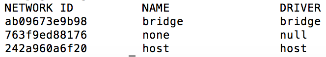

# Entendendo a rede no Docker

O que o docker chama de rede, na verdade é uma abstração criada para facilitar o gerenciamento da comunicação de dados entre containers e os nós externos ao ambiente docker.

Não confunda a rede do docker com a já conhecida rede utilizada para agrupar os endereços IP (ex: 192.168.10.0/24). Sendo assim, sempre que mencionarmos esse segundo tipo de rede, usaremos “rede IP“.

### Redes padrões do Docker

O docker é disponibilizado com três redes por padrão. Essas redes oferecem configurações específicas para gerenciamento do tráfego de dados. Para visualizar essas interfaces, basta utilizar o comando abaixo:

docker network ls

O retorno será:



#### Bridge

Cada container iniciado no docker é associado a uma rede específica. Essa é a rede padrão para qualquer container, a menos que associemos, explicitamente, outra rede a ele. A rede confere ao container uma interface que faz bridge com a interface docker0 do docker host. Essa interface recebe, automaticamente, o próximo endereço disponível na rede IP 172.17.0.0/16.

Todos os containers que estão nessa rede poderão se comunicar via protocolo TCP/IP. Se você souber qual endereço IP do container deseja conectar, é possível enviar tráfego para ele. Afinal, estão todos na mesma rede IP (172.17.0.0/16).

Um detalhe a se observar: como os IPs são cedidos automaticamente, não é tarefa trivial descobrir qual IP do container de destino. Para ajudar nessa localização, o docker disponibiliza, na inicialização de um container, a opção “–link“.

> Vale ressaltar que “–link” é uma opção defasada e seu uso desaconselhado. Explicaremos esta funcionalidade apenas para efeito de entendimento do legado. Essa função foi substituída por um DNS embutido no docker e, não funciona para redes padrões do docker, apenas disponível para redes criadas pelo usuário.

A opção “–link” é responsável por associar o IP do container de destino ao seu nome. Caso você inicie um container a partir da imagem docker do mysql com nome “bd”, em seguida inicie outro com nome “app” a partir da imagem tutum/apache-php, você deseja que esse último container possa conectar no mysql usando o nome do container “bd”, basta iniciar da seguinte forma ambos os containers:

```
docker container run -d --name bd -e MYSQL_ROOT_PASSWORD=minhasenha mysql

docker container run -d -p 80:80 --name app --link db tutum/apache-php
```

Após executar os comandos, o container com o nome “app” poderá conectar no container do mysql usando o nome “bd”, ou seja, toda vez que ele tentar acessar o nome “bd” ele será automaticamente resolvido para o IP da rede IP 172.17.0.0/16 que o container do mysql obteve na sua inicialização.

Pra testar, utilizaremos a funcionalidade exec para rodar o comando dentro de um container já existente. Para tal, usaremos o nome do container como parâmetro do comando abaixo:

```
docker container exec -it app ping db
```
A ação será responsável por executar o comando “ping db” dentro do container “app”, ou seja, o container “app” enviará pacotes icmp, normalmente usado para testar conectividade entre dois hosts, para o endereço “db”. O nome “db” é traduzido para o IP que o container, iniciado a partir da imagem do mysql, obteve ao iniciar.

**Exemplo:** O container “db” iniciou primeiro e obteve o IP 172.17.0.2. O container “app” iniciou em seguida e recebeu o IP 172.17.0.3. Quando o container “app” executar o comando “ping db”, na verdade, ele enviará pacotes icmp para o endereço 172.17.0.2.

> Atenção: O nome da opção “–link” causa certa confusão, pois não cria link de rede IP entre os containers, uma vez que a comunicação entre eles já é possível, mesmo sem a opção link ser configurada. Como esclarecido no parágrafo anterior, apenas facilita a tradução de nomes para o IP dinâmico obtido na inicialização.

Os containers configurados para essa rede terão a possibilidade de tráfego externo utilizando as rotas das redes IP definidas no docker host. Caso o docker host tenha acesso a internet, automaticamente, os containers em questão também terão.

Nessa rede é possível expor portas dos containers para todos os ativos com acesso ao docker host.

#### None

Essa rede tem como objetivo isolar o container para comunicações externas. A rede não recebe qualquer interface para comunicação externa. A única interface de rede IP será a localhost.

Essa rede, normalmente, é utilizada para containers que manipulam apenas arquivos, sem necessidade de enviá-los via rede para outro local. (Ex.: container de backup utiliza os volumes de container de banco de dados para realizar o dump e, será usado no processo de retenção dos dados).


Em caso de dúvida sobre utilização de volumes no docker visite [esse artigo](http://techfree.com.br/2015/12/entendendo-armazenamentos-de-dados-no-docker/) e entenda mais sobre armazenamento do docker.

#### Host

Essa rede tem como objetivo entregar para o container todas as interfaces existentes no docker host. De certa forma, pode agilizar a entrega dos pacotes, uma vez que não há bridge no caminho das mensagens. Mas normalmente esse overhead é mínimo e o uso de uma brigde pode ser importante para segurança e gerencia do seu tráfego.

### Redes definidas pelo usuário

O docker possibilita que o usuário crie redes. Essas redes são associadas ao elemento que o docker chama de driver de rede.

Cada rede criada por usuário deve estar associada a um determinado driver. E, caso você não crie seu próprio driver, deve escolher entre os drivers disponibilizados pelo docker:

#### Bridge

Essa é o driver de rede mais simples de utilizar, pois demanda pouca configuração. A rede criada por usuário utilizando o driver bridge assemelha-se bastante à rede padrão do docker denominada “bridge”.

> Mais um ponto que merece atenção: o docker tem uma rede padrão chamada “bridge” que utiliza um driver também chamado de “bridge“. Talvez, por conta disso, a confusão só aumente. Mas é importante deixar claro que são distintas.

As redes criadas pelo usuário com o driver bridge tem todas as funcionalidades descritas na rede padrão, chamada bridge. Porém, com funcionalidades adicionais.

Dentre uma das funcionalidades: a rede criada pelo usuário não precisa mais utilizar a opção antiga “–link”. Pois, toda rede criada pelo usuário com o driver bridge poderá utilizar o DNS interno do Docker que, associa, automaticamente, todos os nomes de containers dessa rede para seus respectivos IPs da rede IP correspondente.

Para deixar mais claro: todos os containers que estiverem utilizando a rede padrão bridge não poderão usufruir da funcionalidade de DNS interno do Docker. Caso utilize essa rede, é preciso especificar a opção legada “–link” para tradução dos nomes em endereços IPs dinamicamente alocados no docker.

Para exemplificar a utilização de rede criada por usuário vamos criar a rede chamada isolated_nw com o driver bridge:

```
docker network create --driver bridge isolated_nw
```
Agora verificamos a rede:

```
docker network list
```
O resultado deve ser:


Agora iniciamos um container na rede isolated_nw:

```
docker container run -itd --net isolated_nw alpine sh
```


Vale salientar: um container que está em determinada rede não acessa outro container que está em outra rede. Mesmo que você conheça o IP de destino. Para que um container acesse outro container de outra rede, é necessário que a origem esteja presente nas duas redes que deseja alcançar.

Os containers que estão na rede isolated_nw podem expor suas portas no docker host e essas portas podem ser acessadas tanto por containers externos a rede, chamada isolated_nw, como máquinas externas com acesso ao docker host.


Para descobrir quais containers estão associados a uma determinada rede, execute o comando abaixo:

```
docker network inspect isolated_nw
```

O resultado deve ser:


Dentro da sessão “Containers” é possível verificar quais containers fazem parte dessa rede. Todos os containers que estiverem na mesma rede poderão se comunicar utilizando apenas seus respectivos nomes. Como podemos ver no exemplo acima, caso um container novo acesse a rede isolated_nw, ele poderá acessar o container amazing_noyce utilizando apenas seu nome.

#### Overlay

O driver overlay permite comunicação entre hosts docker, utilizando-o os containers de um determinado host docker poderão acessar, nativamente, containers de um outro ambiente docker.

Esse driver demanda configuração mais complexa, sendo assim, trataremos do detalhamento em outra oportunidade.

### Utilizando redes no docker compose

O assunto merece um artigo exclusivo. Então, apenas informaremos [um link interessante](https://docs.docker.com/compose/networking/) para referência sobre o assunto.

### Conclusão

Percebemos que a utilização de redes definidas por usuário torna obsoleta a utilização da opção “–link”, bem como viabiliza novo serviço de DNS interno do docker, o que facilita para quem se propõe a manter uma infraestrutura docker grande e complexa, assim como viabilizar o isolamento de rede dos seus serviços.

Conhecer e utilizar bem as tecnologias novas é uma boa prática que evita problemas futuros e facilita a construção e manutenção de projetos grandes e complexos.
